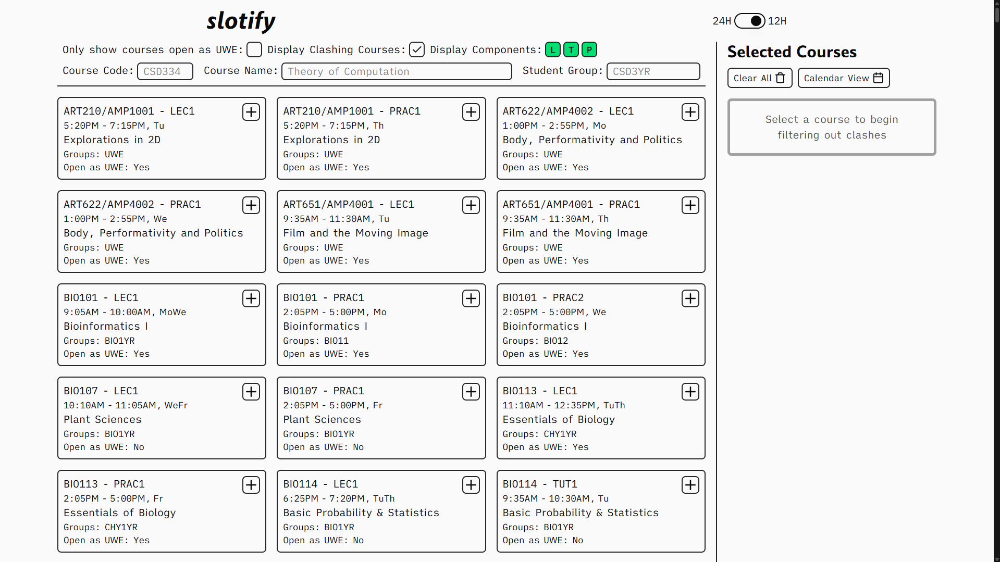
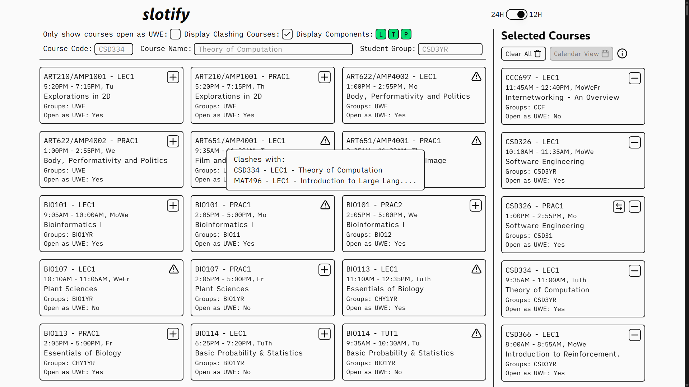

# slotify
Simplify looking for clashes with slotify. Simply select your core courses and let slotify crush your dreams of taking that UWE you've been eyeing for two semesters


## Live Deployment
A live deployment can be found at [slotify.lm04.me](https://slotify.lm04.me)

> Base Website
> 

> Clash Warning
> 

---

## Deploying Locally
- Clone the repository
```bash
git clone https://gihub.com/lalitm1004/slotify.git
cd slotify
```

### Frontend
```bash
npm i
npm run dev
```

### Timetable Processor
1. Navigate into directory
```bash
cd timetable-processor
```

2. Ensure a `time-table.xlsx` file is present in `data/`.
> NOTE: The timetable file the administration shares might be different and require modification of the processor script. 

3. Install all requirements and run
```bash
uv sync
uv run main.py

# For a minified JSON output
uv run main.py --minify
```


## composition
```bash
$ composition
Svelte     | 766 lines | 50.69% | ███████████████████████████████████████████████████
TypeScript | 343 lines | 22.70% | ███████████████████████
Python     | 284 lines | 18.80% | ███████████████████
CSS        |  81 lines |  5.36% | █████
HTML       |  20 lines |  1.32% | █
JavaScript |  17 lines |  1.13% | █
```