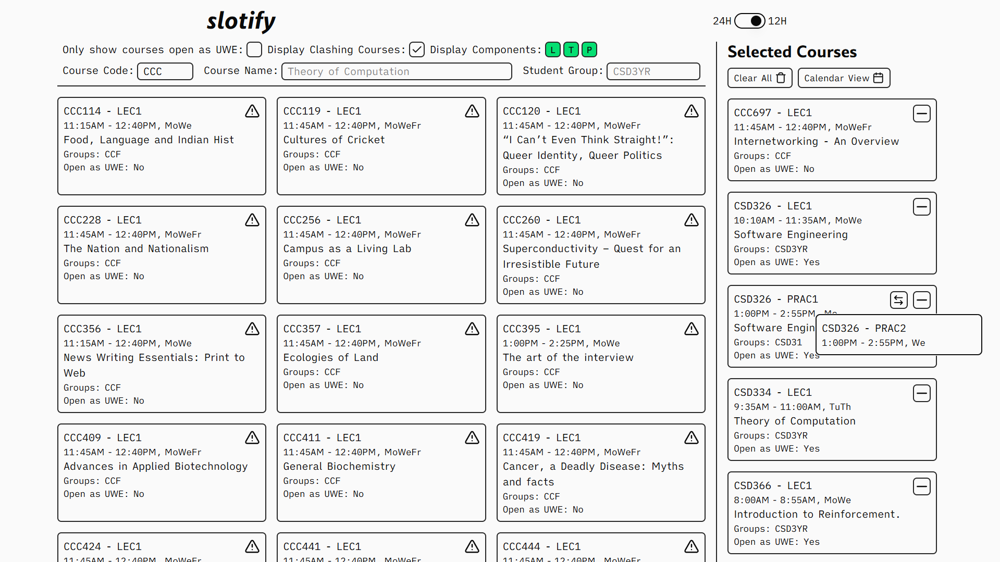

# slotify
Simplify looking for clashes with slotify. Simply select your core courses and let slotify crush your dreams of taking that UWE you've been eyeing for two semesters


## Live Deployment
A live deployment can be found at [slotify.lm04.me](https://slotify.lm04.me)

> Base Website
> 

> Clash Warning
> 

> Swap Components
> 
---

## 💻 Running Locally

### 1. Clone the Repository
```bash
git clone https://gihub.com/lalitm1004/slotify.git
cd slotify
```

### 2. Timetable Processor
1. Navigate into directory
```bash
cd timetable-processor
```

2. Ensure a `time-table.xlsx` file is present in `data/`.
> NOTE: The timetable file the administration shares might be different and require modification of the processor script. 

3. Install all requirements and run
```bash
uv sync
uv run main.py
```

4. Move the generated file into appropriate location
```bash
mv data/time-table.json ../src/lib/server/data/
```

5. Update the `DATA_VERSION` constant in `src/lib/data/constants.ts` to force an update on redeployment


### 3. Frontend
Finally, simply install all requirements and run
```bash
npm i
npm run dev
```

