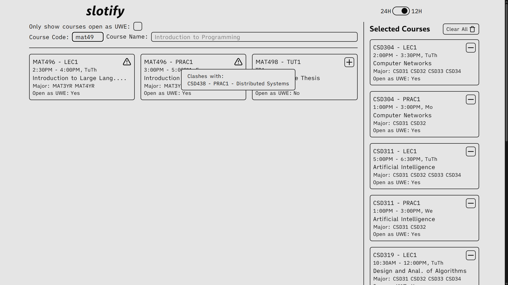

# slotify
Simplify looking for clashes with slotify. Simply select your core courses and let slotify crush your dreams of taking that UWE you've been eyeing for two semesters


## Live Deployment
A live deployment can be found at [slotify.lm04.me](https://slotify.lm04.me)

> Base Website
> 

> Clash Warning
> 

---

## Deploying Locally
### Frontend
1. Clone this repository
```bash
git clone https://github.com/lalitm1004/slotify.git
cd clotify
```

2. Install all requirements and run dev servers
```bash
npm i
npm run dev
```

### Timetable Processor
1. Navigate into directory
```bash
cd timetable-processor
```

2. Ensure a `time-table.xlsx` file is present at `data/`.
> NOTE: The timetable file the administration shares might be different and require modification of the processor script. 

3. Install all requirements and run
```bash
uv sync
uv run main.py
```

## composition
```bash
$ composition
Svelte     | 540 lines | 44.30% | ████████████████████████████████████████████
TypeScript | 300 lines | 24.61% | █████████████████████████
Python     | 266 lines | 21.82% | ██████████████████████
CSS        |  81 lines |  6.64% | ███████
JavaScript |  17 lines |  1.39% | █
HTML       |  15 lines |  1.23% | █
```